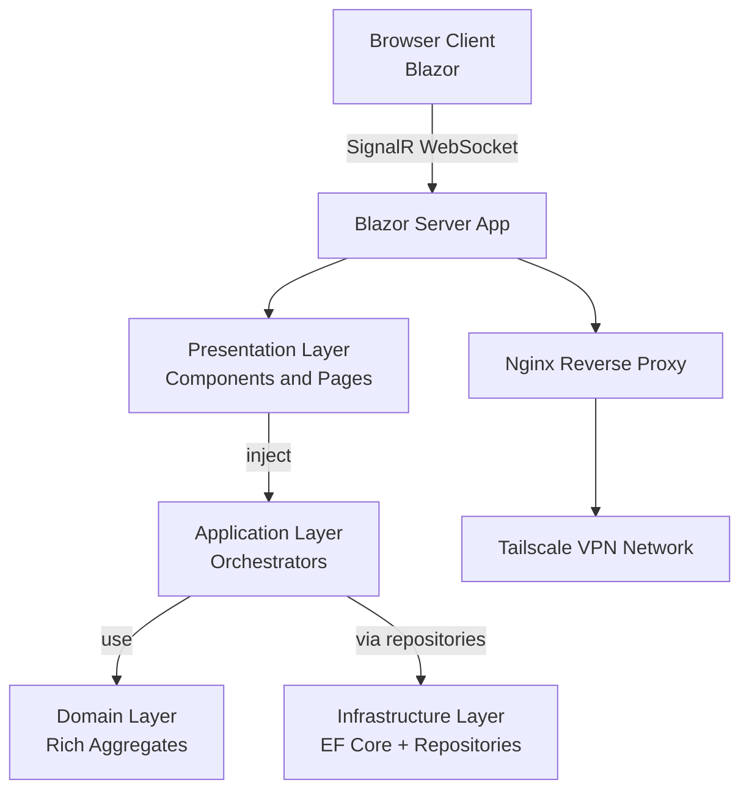
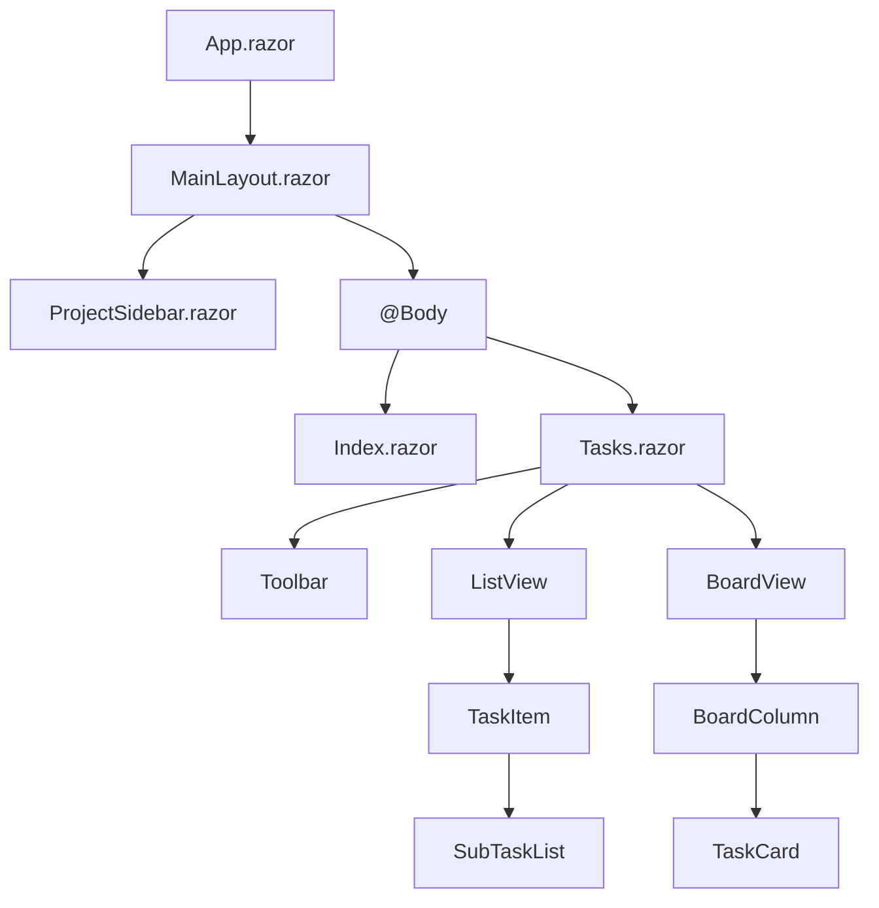
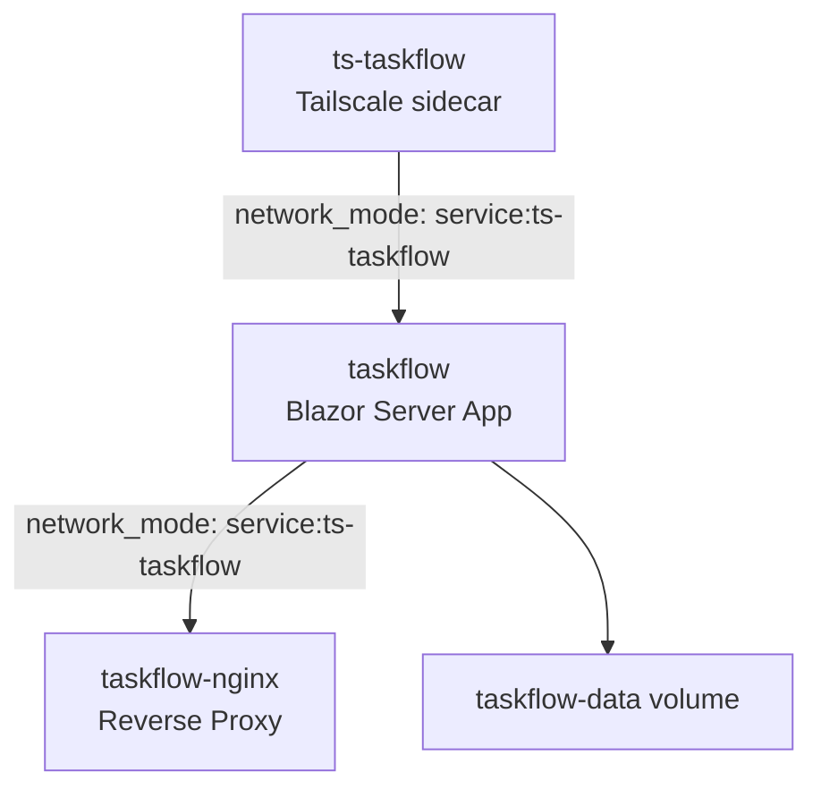

# TaskFlow - System Design Document

## Table of Contents
1. [Overview](#overview)
2. [Architecture](#architecture)
3. [Technology Stack](#technology-stack)
4. [Database Schema](#database-schema)
5. [Services Layer](#services-layer)
6. [UI Components](#ui-components)
7. [State Management](#state-management)
8. [Security](#security)
9. [Deployment](#deployment)
10. [Scalability](#scalability)

---

## Overview

TaskFlow is a task management application built with Blazor Server, providing users with the ability to organize tasks into projects, manage priorities, and visualize workflows using Kanban boards.

### Key Features
- **Project Management**: Create, edit, and organize tasks into projects
- **Task Management**: Create, edit, delete, and complete tasks with priorities
- **Subtasks**: 1-level nested subtasks with auto-completion
- **Multiple Views**: List view and Kanban board view per project
- **Advanced UX**: In-line editing, keyboard shortcuts, search, sort, filters
- **Real-time Updates**: Blazor Server SignalR for live UI updates
- **Mobile-First**: Fully responsive design with desktop-first approach

### Target Environment
- **Platform**: Raspberry Pi 5 (ARM64, Debian 13)
- **Access**: Private network via Tailscale VPN
- **URL**: http://taskflow.churra-platy.ts.net
- **Scale**: Single user deployment (personal use)

### Current Implementation Snapshot (2026-02-09)

The repository currently contains the foundational architecture, persistence baseline, and application orchestration baseline:

- **Solution and projects created**: `TaskFlow.sln` with `TaskFlow.Domain`, `TaskFlow.Application`, `TaskFlow.Infrastructure`, `TaskFlow.Presentation`, and `TaskFlow.UnitTests`.
- **Project references wired**: `Presentation -> Application, Infrastructure`, `Application -> Domain`, `Infrastructure -> Domain`, tests reference `Domain` and `Application`.
- **Domain baseline implemented**: `Project`, `Task`, `FocusSession`, `Subscription`, and `SubscriptionSchedule` aggregates plus value enums and repository interfaces.
- **Subscription model baseline**: each user is expected to operate within one current subscription context, with subscription schedules and tiers (`Free`, `Plus`, `Pro`).
- **Infrastructure baseline implemented (0C)**: `AppDbContext`, EF Core mappings, repositories using `IDbContextFactory`, migration baseline, and initial data seeding.
- **Application baseline implemented (0D)**: project and task orchestrators provide immediate-persistence use-case methods for create/update operations.
- **Nullable annotations policy in code**: Nullable reference type annotations are disabled for this codebase; public APIs avoid nullable reference annotations.
- **Build configuration centralized**: `Directory.Build.props` configures language/features, warning policy, and MinVer integration.
- **NuGet versions centralized**: `Directory.Packages.props` enables central package management.
- **Versioning baseline set**: Local tool manifest (`dotnet-tools.json`) includes `minver-cli`; build integrates MinVer for tag-based versioning.
- **CI baseline added**: `.github/workflows/build.yml` restores, builds, tests, and builds the container image (without push).
- **Container build baseline added**: Root `Dockerfile` publishes and runs `TaskFlow.Presentation`.
- **Logging baseline added**: Serilog is configured for console and rolling file sinks in presentation app settings.

---

## Architecture

### High-Level Architecture




### Architectural Decisions

#### Why Rich Domain Model?
- **Business Logic Encapsulation**: Business rules live where they belong - in domain entities
- **Type Safety**: Domain methods enforce invariants and prevent invalid state
- **Testability**: Domain logic can be tested in isolation without infrastructure
- **Maintainability**: Changes to business rules are localized to domain entities
- **Clear Intent**: Method names like Complete(), AddSubTask() make code self-documenting
- **No Anemic Models**: Avoids the anti-pattern of entities with only getters/setters

#### Why No DTOs?
- **Simplicity**: Eliminates mapping layer and potential mapping bugs
- **Performance**: No overhead of copying data between entities and DTOs
- **Rich Domain Benefits**: Presentation layer benefits from domain methods
- **Less Code**: No DTO classes, no mappers, fewer tests needed
- **Single Source of Truth**: Domain model is the only model

#### Why Minimal Orchestrators?
- **Separation of Concerns**: Orchestrators coordinate, entities contain business logic
- **Single Responsibility**: Orchestrators orchestrate, entities encapsulate behavior
- **Easier Testing**: Domain logic tested without orchestrators
- **Better Organization**: Clear distinction between orchestration and business logic

#### Why Blazor Server?
- **Simplicity**: Single project architecture vs. Blazor WASM (3 projects)
- **No API Layer**: Direct EF Core access eliminates REST endpoint design
- **Built-in Real-time**: SignalR automatically syncs UI across clients
- **Faster Development**: Less boilerplate, easier debugging
- **Server-Side Rendering**: Better SEO if needed, smaller client payload

#### Why SQLite?
- **Single User Deployment**: No need for full database server
- **Zero Configuration**: Embedded, no separate database process
- **Portability**: Easy backup and migration
- **Performance**: Sufficient for personal use scale

#### Why MudBlazor?
- **Component Library**: Ready-made UI components with consistent design
- **Material Design**: Modern, familiar UI patterns
- **Customizable**: Easy theming and styling
- **Accessibility**: Built-in ARIA labels and keyboard navigation

#### Why Clean Architecture (Onion)?
- **Separation of Concerns**: Each layer has a single responsibility
- **Testability**: Infrastructure and domain can be tested independently
- **Maintainability**: Changes in one layer don't affect others
- **Scalability**: Easy to add new features by extending layers
- **Dependency Inversion**: Dependencies flow inward, enabling loose coupling
- **Domain Logic Protection**: Business rules in domain layer, not in UI

#### Why Repository Pattern?
- **Data Access Abstraction**: Database access abstracted through interfaces
- **Blazor Server Safety**: Repositories create short-lived DbContext instances via `IDbContextFactory<AppDbContext>`

#### Why Value Objects?
- **Type Safety**: Encapsulate related concepts (Priority, Status) in types
- **Immutability**: Prevent invalid state changes
- **Validation**: Centralized validation logic
- **Reusability**: Same types used across all layers

#### Why Interface-Based Orchestrators?
- **Testability**: Orchestrators can be mocked for feature testing
- **Loose Coupling**: Dependencies flow inward, allowing implementations to change
- **Focused Contracts**: Interfaces define what features need, not how they work
- **Multiple Implementations**: Different features can have different implementations

---

## Clean Architecture Layers

### Presentation Layer (UI)
**Responsibility**: User interface and interaction only
- Razor Components and Pages
- No business logic
- Uses domain aggregates directly (no DTOs)
- Depends on Application Layer interfaces (orchestrators)
- **Feature slice organization**
- **Moderate nesting** - not too deeply nested

**Key Components:**
- `MainLayout.razor` - App shell
- `ProjectSidebar.razor` - Navigation
- `Tasks.razor` - Project tasks view
- `BoardView.razor` - Kanban board
- Shared Components: TaskCard, PriorityBadge, FocusButton, EmptyState, FilterDropdown

**Feature Slice Structure:**


**Dependency Flow:**


**Rules:**
- No direct database access
- No business logic (call domain methods)
- Only UI state management
- Uses domain aggregates directly (no DTOs)
- Calls orchestrator methods for coordination
- Organized by feature (Pages, Components)
- No technical subfolders like "Layout", "Shared"

### Application Layer (Orchestration)
**Responsibility**: Minimal orchestration, coordination, transactions
- Orchestrators implementing interfaces (minimal code)
- Coordinates between repositories and domain
- Handles transactions and workflows
- NO business logic (delegates to domain entities)
- **Feature slice organization** - no technical subfolders (Interfaces, etc.)
- **Minimal nesting** - organized by feature, not too deep

**Key Orchestrators:**
- `ProjectOrchestrator` - Project orchestration (minimal)
- `TaskOrchestrator` - Task orchestration (minimal)
- `FocusTimerOrchestrator` - Focus timer orchestration (Phase 3)

**Feature Slice Structure:**


**Dependency Flow:**


**Rules:**
- No direct database access (uses repositories)
- Uses domain aggregates directly (no DTOs for app logic)
- Minimal code - only orchestration and coordination
- All business logic delegated to domain entities
- Transaction management
- Cross-aggregate operations
- Organized by feature (Project, Task, FocusTimer)
- No technical subfolders like "Interfaces"

### Domain Layer
**Responsibility**: Rich domain entities with business logic, value objects, repository interfaces
- Domain entities (Task, Project, FocusSession) with behavior methods
- Value objects (Priority, Status, ProjectViewType)
- Repository interfaces (ITaskRepository, IProjectRepository)
- NO domain services (business logic in entities)
- **Single flat folder** - no technical subfolders (Entities, Interfaces, etc.)

**Key Components:**


**Important**: All domain types in single flat Domain folder. No technical subfolders like "Entities", "Interfaces", or "ValueObjects".

**Entity Business Methods:**
- `Task.Complete()` - Marks task and subtasks complete
- `Task.AddSubTask()` - Adds child task with consistency checks
- `Task.MoveToProject()` - Changes project association
- `Task.SetPriority()` - Updates priority
- `Task.ToggleFocus()` - Toggles focus pin
- `Task.UpdateTitle()` - Validates and updates title
- `Task.UpdateNote()` - Updates note
- `Task.SetStatus()` - Changes status with side effects
- `Project.AddTask()` - Adds task to project
- `Project.RemoveTask()` - Removes task from project
- `Project.UpdateViewType()` - Changes view type
- `Project.GetTaskCount()` - Calculates task count
- `Project.UpdateName()` - Validates and updates name
- `Project.UpdateColor()` - Updates color
- `Project.UpdateIcon()` - Updates icon

**Dependency Flow:**


**Rules:**
- No external dependencies (pure .NET types)
- Encapsulates business logic in entities
- Validates invariants in entity methods
- Repository interfaces for data access
- NO domain services (business logic in entities)

### Infrastructure Layer
**Responsibility**: Data persistence and external system integration
- EF Core DbContext
- Repository implementations
- Database seeding
- Configuration
- **Minimal nesting** - no technical subfolders (Repositories, etc.)

**Key Components:**


**Important**: All data access code in flat Infrastructure/Data folder. No "Repositories" subfolder.

**Dependency Flow:**


**Rules:**
- Implements domain interfaces
- Contains EF Core specific code
- Handles database-specific concerns
- No business logic

### Repository + EF Core rule (Blazor Server)

**Use `IDbContextFactory<TContext>` inside repositories. Do not inject `DbContext` directly.**

#### Mandatory rules

1. **Repositories MUST depend on `IDbContextFactory<TContext>`**
   - Repositories create and dispose DbContexts.
   - DbContext lifetime is per repository method call.

2. **One repository method = one DbContext**
   - Create DbContext at the start of each method.
   - Dispose DbContext at method end (`await using`).
   - Never store DbContext in fields.

3. **Repositories MUST be stateless**
   - No cached entities.
   - No shared DbContext.
   - No cross-call tracking.

4. **Reads are `AsNoTracking()` by default**
   - Tracking is only used when explicitly required for updates.

5. **Repository methods represent a single unit of work**
   - CRUD-style operations only.
   - No multi-repository orchestration inside repositories.

#### Required registration pattern

```csharp
builder.Services.AddDbContextFactory<AppDbContext>(options =>
    options.UseSqlite("Data Source=app.db"));

builder.Services.AddScoped<ITaskRepository, TaskRepository>();
```

#### Required repository pattern

```csharp
public sealed class TaskRepository : ITaskRepository
{
    private readonly IDbContextFactory<AppDbContext> _factory;

    public TaskRepository(IDbContextFactory<AppDbContext> factory)
        => _factory = factory;

    public async Task<IReadOnlyList<TaskItem>> GetAllAsync(CancellationToken ct = default)
    {
        await using var db = await _factory.CreateDbContextAsync(ct);
        return await db.Tasks
            .AsNoTracking()
            .ToListAsync(ct);
    }

    public async Task AddAsync(TaskItem item, CancellationToken ct = default)
    {
        await using var db = await _factory.CreateDbContextAsync(ct);
        db.Tasks.Add(item);
        await db.SaveChangesAsync(ct);
    }
}
```

#### Explicit non-goals

- No long-lived DbContext (especially not per Blazor circuit).
- No DbContext injected into components.
- No repositories calling other repositories.
- No implicit transactions across methods.

#### Escalation rule

If an operation requires multiple repository calls in one transaction:

- Create an application service/orchestrator method that uses `IDbContextFactory<AppDbContext>`.
- Own one DbContext and transaction in that method.
- Keep repositories simple and single-purpose.

---

## Dependency Inversion Flow

```
```

---

## Orchestrator Interfaces

### IProjectOrchestrator (Application Layer)
```csharp
public interface IProjectOrchestrator
{
    Task<List<Project>> GetAllProjectsAsync();
    Task<Project?> GetProjectByIdAsync(Guid id);
    Task<Project> CreateProjectAsync(string name, string color, string icon);
    Task<Project?> UpdateProjectAsync(Guid id, string name, string color, string icon);
    Task<bool> DeleteProjectAsync(Guid id);
    Task<Project?> UpdateViewTypeAsync(Guid projectId, ProjectViewType viewType);
    Task<int> GetTaskCountAsync(Guid projectId);
}
```

### ITaskOrchestrator (Application Layer)
```csharp
public interface ITaskOrchestrator
{
    Task<List<Task>> GetTasksByProjectAsync(Guid projectId);
    Task<Task?> GetTaskByIdAsync(Guid id);
    Task<Task> CreateTaskAsync(string title, Guid projectId);
    Task<bool> UpdateTaskAsync(Task task);
    Task<bool> DeleteTaskAsync(Guid id);
    Task<bool> CompleteTaskAsync(Guid id);
    Task<bool> ToggleFocusAsync(Guid id);
    Task<bool> MoveTaskToProjectAsync(Guid taskId, Guid newProjectId);
    Task<Task?> DuplicateTaskAsync(Guid taskId);
    Task<int> ClearCompletedAsync(Guid projectId);
    Task<List<Task>> SearchTasksAsync(string query, Guid projectId);
    Task<List<Task>> GetTasksByPriorityAsync(TaskPriority priority, Guid projectId);
    Task<List<Task>> GetFocusedTasksAsync(Guid projectId);
    Task<Task> CreateSubTaskAsync(Guid parentTaskId, string title);
    Task<bool> SetTaskStatusAsync(Guid taskId, TaskStatus status);
}
```

### IProjectRepository (Domain Layer)
```csharp
public interface IProjectRepository
{
    Task<List<Project>> GetAllAsync();
    Task<Project?> GetByIdAsync(Guid id);
    Task<Project> AddAsync(Project project);
    Task<Project> UpdateAsync(Project project);
    Task<bool> DeleteAsync(Guid id);
}
```

### ITaskRepository (Domain Layer)
```csharp
public interface ITaskRepository
{
    Task<List<Task>> GetByProjectIdAsync(Guid projectId);
    Task<List<Task>> GetByPriorityAsync(TaskPriority priority, Guid projectId);
    Task<List<Task>> SearchAsync(string query, Guid projectId);
    Task<List<Task>> GetFocusedAsync(Guid projectId);
    Task<Task> AddAsync(Task task);
    Task<Task> UpdateAsync(Task task);
    Task<bool> DeleteAsync(Guid id);
    Task<Task?> GetByIdAsync(Guid id);
}
```

---

## Component Reusability

### Shared Components (Presentation/Shared)
Components extracted for reuse across List and Board views:

**PriorityBadge.razor**
- Displays task priority with appropriate color
- Accepts TaskPriority enum
- Used in: TaskItem.razor, TaskCard.razor

**FocusButton.razor**
- Toggle button for task focus pin
- Visual indicator when focused
- Used in: TaskItem.razor, TaskCard.razor

**TaskCard.razor**
- Reusable task display component
- Supports both List and Board views
- Includes: Title, Note, Priority, Focus, Actions
- Used in: ListView.razor, BoardColumn.razor

**EmptyState.razor**
- Displays empty state with icon and message
- Customizable for different contexts
- Used in: Todos.razor, Today.razor, Upcoming.razor, Recent.razor

**FilterDropdown.razor**
- Reusable filter dropdown component
- Supports different filter types
- Used in: Todos.razor, Today.razor, Upcoming.razor

---

## Technology Stack

### Backend
- **Framework**: .NET 10.0 (ASP.NET Core) with C# 14
- **Runtime**: Blazor Server
- **Data Access**: Entity Framework Core 10
- **Database**: SQLite
- **Real-time**: SignalR (built into Blazor Server)

### Frontend
- **UI Framework**: Razor Components
- **Component Library**: MudBlazor 8.x
- **Styling**: CSS with MudBlazor theming
- **Icons**: Material Design Icons (via MudBlazor)

### DevOps
- **Container**: Docker
- **Reverse Proxy**: Nginx
- **Network**: Tailscale VPN
- **Monitoring**: Uptime Kuma integration

### Development
- **IDE**: Any .NET-compatible IDE
- **Build Tool**: .NET CLI
- **Package Manager**: NuGet

### NuGet Packages
```xml
<PackageReference Include="MudBlazor" Version="7.x" />
<PackageReference Include="Microsoft.EntityFrameworkCore.Sqlite" Version="10.x" />
<PackageReference Include="Microsoft.EntityFrameworkCore.Design" Version="10.x" />
```

---

## Database Schema

### Entity Relationship Diagram

```
```

### Tables

#### Project (Rich Aggregate)
```csharp
public class Project
{
    public Guid Id { get; private set; }          // Primary Key
    public string Name { get; private set; }        // Project name
    public string Color { get; private set; }       // Hex color code, e.g., "#40E0D0"
    public string Icon { get; private set; }        // Material icon name, e.g., "folder"
    public bool IsDefault { get; private set; }     // Is this the default "Inbox" project?
    public ProjectViewType ViewType { get; private set; } // List or Board
    public DateTime CreatedAt { get; private set; } // Creation timestamp
    public List<Task> Tasks { get; private set; } = new(); // Navigation property

    // Business Logic Methods
    public void AddTask(Task task)
    {
        task.MoveToProject(Id);
        Tasks.Add(task);
    }

    public void RemoveTask(Task task)
    {
        Tasks.Remove(task);
    }

    public void UpdateViewType(ProjectViewType viewType)
    {
        ViewType = viewType;
    }

    public int GetTaskCount()
    {
        return Tasks.Count(t => !t.IsCompleted);
    }

    public void UpdateName(string newName)
    {
        if (string.IsNullOrWhiteSpace(newName))
            throw new ArgumentException("Name cannot be empty");
        Name = newName;
    }

    public void UpdateColor(string newColor)
    {
        Color = newColor;
    }

    public void UpdateIcon(string newIcon)
    {
        Icon = newIcon;
    }
}

public enum ProjectViewType
{
    List,
    Board
}
```

#### Task (Rich Aggregate)
```csharp
public class Task
{
    public Guid Id { get; private set; }                    // Primary Key
    public string Title { get; private set; }              // Task title
    public string? Note { get; private set; }             // Additional notes (optional, nullable)
    public TaskPriority Priority { get; private set; }     // 1=Low, 2=Medium, 3=High
    public bool IsCompleted { get; private set; }          // Completion status
    public bool IsFocused { get; private set; }            // Focus pin for prioritized display
    public TaskStatus Status { get; private set; }         // ToDo, InProgress, Done
    public Guid ProjectId { get; private set; }            // Foreign Key to Project
    public Project Project { get; private set; }           // Navigation property
    public Guid? ParentTaskId { get; private set; }       // For SubTasks (nullable)
    public Task ParentTask { get; private set; }           // Navigation property (parent)
    public List<Task> SubTasks { get; private set; } = new(); // Navigation property (children)
    public DateTime CreatedAt { get; private set; }        // Creation timestamp
    public DateTime? CompletedAt { get; private set; }      // Completion timestamp

    // Business Logic Methods
    public void Complete()
    {
        IsCompleted = true;
        CompletedAt = DateTime.UtcNow;
        Status = TaskStatus.Done;
        foreach (var subTask in SubTasks)
        {
            subTask.Complete();
        }
    }

    public void Uncomplete()
    {
        IsCompleted = false;
        CompletedAt = null;
        // Note: SubTasks stay completed per requirements
    }

    public void AddSubTask(Task subTask)
    {
        subTask.ParentTaskId = Id;
        SubTasks.Add(subTask);
    }

    public void SetPriority(TaskPriority priority)
    {
        Priority = priority;
    }

    public void ToggleFocus()
    {
        IsFocused = !IsFocused;
    }

    public void MoveToProject(Guid newProjectId)
    {
        ProjectId = newProjectId;
    }

    public void UpdateTitle(string newTitle)
    {
        if (string.IsNullOrWhiteSpace(newTitle))
            throw new ArgumentException("Title cannot be empty");
        Title = newTitle;
    }

    public void UpdateNote(string? newNote)
    {
        Note = newNote;
    }

    public void SetStatus(TaskStatus status)
    {
        Status = status;
        if (status == TaskStatus.Done)
        {
            Complete();
        }
    }
}

public enum TaskStatus
{
    ToDo,
    InProgress,
    Done
}

public enum TaskPriority
{
    Low = 1,
    Medium = 2,
    High = 3
}
```

### Indexes
- `Tasks_ProjectId`: Index on ProjectId for faster project queries
- `Tasks_Priority`: Index on Priority for filtering
- `Tasks_IsCompleted`: Index on IsCompleted for filtering
- `Tasks_IsFocused`: Index on IsFocused for focused tasks
- `Tasks_Status`: Index on Status for board views
- `Tasks_ParentTaskId`: Index on ParentTaskId for SubTask queries

### Seeding
Initial data:
- 1 default project: "Inbox" (IsDefault=true, Color="#40E0D0", Icon="inbox")
- 3 sample tasks with different priorities and notes
- 1 sample task with IsFocused=true
- All with CreatedAt timestamps

---

## Services Layer

### Orchestrator Architecture Pattern

### Key Architectural Points

1. **Components use domain aggregates directly**
   - No DTOs
   - Task and Project entities traverse to presentation
   - Components call domain methods for business logic

2. **Orchestrators are minimal**
   - Only orchestration and coordination
   - No business logic (delegates to domain)
   - Handle transactions
   - Coordinate between repositories

3. **Domain entities contain business logic**
   - Task.Complete(), Task.AddSubTask(), etc.
   - Project.AddTask(), Project.RemoveTask(), etc.
   - Rich domain model (not anemic)

4. **Repositories handle data access only**
   - CRUD operations
   - Query operations
   - No business logic

### Orchestrator Examples

#### ProjectOrchestrator
```csharp
public class ProjectOrchestrator : IProjectOrchestrator
{
    private readonly IProjectRepository _projectRepository;
    private readonly ITaskRepository _taskRepository;

    public async Task<Project> CreateProjectAsync(string name, string color, string icon)
    {
        // Domain entity creation
        var project = new Project
        {
            Id = Guid.NewGuid(),
            Name = name,
            Color = color,
            Icon = icon,
            IsDefault = false,
            ViewType = ProjectViewType.List,
            CreatedAt = DateTime.UtcNow
        };

        return await _projectRepository.AddAsync(project);
    }

    public async Task<Project?> UpdateViewTypeAsync(Guid projectId, ProjectViewType viewType)
    {
        var project = await _projectRepository.GetByIdAsync(projectId);
        if (project == null) return null;

        // Domain logic
        project.UpdateViewType(viewType);

        return await _projectRepository.UpdateAsync(project);
    }

    public async Task<int> GetTaskCountAsync(Guid projectId)
    {
        var project = await _projectRepository.GetByIdAsync(projectId);
        return project?.GetTaskCount() ?? 0; // Domain logic
    }
}
```

#### TaskOrchestrator
```csharp
public class TaskOrchestrator : ITaskOrchestrator
{
    private readonly ITaskRepository _taskRepository;
    private readonly IProjectRepository _projectRepository;

    public async Task<Task> CreateTaskAsync(string title, Guid projectId)
    {
        var project = await _projectRepository.GetByIdAsync(projectId);
        if (project == null)
            throw new NotFoundException("Project not found");

        // Domain entity creation
        var task = new Task
        {
            Id = Guid.NewGuid(),
            Title = title,
            Priority = TaskPriority.Medium,
            Status = TaskStatus.ToDo,
            IsCompleted = false,
            IsFocused = false,
            ProjectId = projectId,
            CreatedAt = DateTime.UtcNow
        };

        // Domain logic - add to project
        project.AddTask(task);

        return await _taskRepository.AddAsync(task);
    }

    public async Task<bool> CompleteTaskAsync(Guid taskId)
    {
        var task = await _taskRepository.GetByIdAsync(taskId);
        if (task == null) return false;

        // Domain logic - business rule here!
        task.Complete();

        await _taskRepository.UpdateAsync(task);
        return true;
    }

    public async Task<bool> ToggleFocusAsync(Guid taskId)
    {
        var task = await _taskRepository.GetByIdAsync(taskId);
        if (task == null) return false;

        // Domain logic
        task.ToggleFocus();

        await _taskRepository.UpdateAsync(task);
        return true;
    }

    public async Task<bool> MoveTaskToProjectAsync(Guid taskId, Guid newProjectId)
    {
        var task = await _taskRepository.GetByIdAsync(taskId);
        var oldProject = await _projectRepository.GetByIdAsync(task.ProjectId);
        var newProject = await _projectRepository.GetByIdAsync(newProjectId);

        if (task == null || oldProject == null || newProject == null)
            return false;

        // Cross-aggregate coordination
        oldProject.RemoveTask(task);
        newProject.AddTask(task);

        // Domain logic
        task.MoveToProject(newProjectId);

        await _taskRepository.UpdateAsync(task);
        return true;
    }
}
```

### Dependency Registration and Lifetimes

Application orchestrators and repositories are `Scoped` per Blazor circuit, while EF Core contexts are created per repository method via `IDbContextFactory<AppDbContext>`.

```csharp
builder.Services.AddScoped<IProjectOrchestrator, ProjectOrchestrator>();
builder.Services.AddScoped<ITaskOrchestrator, TaskOrchestrator>();
builder.Services.AddScoped<IProjectRepository, ProjectRepository>();
builder.Services.AddScoped<ITaskRepository, TaskRepository>();
builder.Services.AddScoped<KeyboardService>();

builder.Services.AddDbContextFactory<AppDbContext>(options =>
    options.UseSqlite(builder.Configuration.GetConnectionString("Default")));
```

### Repository Pattern Example

```csharp
public sealed class TaskRepository : ITaskRepository
{
    private readonly IDbContextFactory<AppDbContext> _factory;

    public TaskRepository(IDbContextFactory<AppDbContext> factory)
    {
        this._factory = factory;
    }

    public async Task<List<Task>> GetByProjectIdAsync(Guid projectId)
    {
        await using var db = await this._factory.CreateDbContextAsync();
        return await db.Tasks
            .Where(t => t.ProjectId == projectId)
            .AsNoTracking()
            .ToListAsync();
    }

    public async Task<Task?> GetByIdAsync(Guid id)
    {
        await using var db = await this._factory.CreateDbContextAsync();
        return await db.Tasks
            .FirstOrDefaultAsync(t => t.Id == id);
    }

    public async Task<Task> AddAsync(Task task)
    {
        await using var db = await this._factory.CreateDbContextAsync();
        db.Tasks.Add(task);
        await db.SaveChangesAsync();
        return task;
    }
}
```

---

## UI Components

### Component Hierarchy



### Key Components

#### MainLayout.razor
- **Responsibility**: App shell with sidebar and content area
- **Features**:
  - Dark theme with Turquoise (#40E0D0) accent
  - Responsive sidebar (250px desktop, hamburger on mobile)
  - MudBlazor theming configuration
  - Toast notification container

#### ProjectSidebar.razor
- **Responsibility**: Navigation sidebar with project list
- **Features**:
  - Project list with icons, names, and task counts
  - Color badges for project colors
  - Active project highlighting
  - "Add Project" button
  - Responsive collapse/expand
  - Focused Tasks section (if any tasks are pinned)

#### Tasks.razor
- **Responsibility**: Main task management page
- **Features**:
  - Project header with name and stats
  - Search input (real-time filtering)
  - Sort dropdown (Created date / Priority / Focused)
  - Filter dropdown (All / High / Medium / Low / Completed)
  - Show/hide completed toggle
  - "Clear All Completed" button
  - Add new task input
  - View switcher (List ↔ Board)
  - Empty state when no tasks

#### TaskItem.razor (List View)
- **Responsibility**: Individual task item component
- **Features**:
  - Complete checkbox
  - Focus pin button (toggle IsFocused)
  - In-line title editing (click to edit)
  - Note display (expandable)
  - Priority badge with color coding
  - CreatedAt timestamp
  - CompletedAt timestamp (when completed)
  - Actions menu: Delete, Duplicate, Move, Focus pin, Expand/Collapse SubTasks
  - SubTask count badge
  - Recently completed indicator
  - Visual indicator for focused tasks

#### SubTaskList.razor
- **Responsibility**: Display SubTasks under parent
- **Features**:
  - Indented SubTask items
  - In-line editing for SubTask titles
  - Add SubTask input
  - Delete SubTask with toast + undo
  - Expand/collapse toggle
  - Visual hierarchy

#### BoardView.razor
- **Responsibility**: Kanban board with 3 columns
- **Features**:
  - 3 columns: ToDo, InProgress, Done
  - Drag-and-drop between columns
  - Add task button per column
  - Task count badges per column
  - Column headers with color coding
  - Responsive (stack columns on mobile)

#### BoardColumn.razor
- **Responsibility**: Individual column in board view
- **Features**:
  - Column header with status and count
  - Drop zone for drag-and-drop
  - Add task input
  - Task cards list

#### TaskCard.razor (Board View)
- **Responsibility**: Task card in board view
- **Features**:
  - Title
  - Note preview (if note exists)
  - Priority badge
  - Focus pin indicator
  - SubTask count indicator
  - Actions menu
  - Drag handle

#### ToastNotification.razor
- **Responsibility**: Global toast notifications
- **Features**:
  - Success, info, warning, error variants
  - Auto-dismiss (5 seconds)
  - Undo button for destructive actions
  - Close button
  - Queue for multiple toasts

### Design System

#### Color Palette
```css
--primary: #40E0D0;           /* Turquoise - Custom accent */
--secondary: #48D1CC;         /* Lighter Turquoise */
--success: #10B981;           /* Emerald Green */
--warning: #FF6B6B;           /* Coral Red */
--info: #3B82F6;              /* Blue */
--error: #EF4444;             /* Red */

--priority-high: #FF6B6B;     /* Red */
--priority-medium: #F57C00;   /* Orange */
--priority-low: #10B981;      /* Green */

--bg-dark: #1a1a2e;          /* Dark background */
--bg-card: #16213e;           /* Card background */
--text-primary: #ffffff;      /* Primary text */
--text-secondary: #a0a0a0;    /* Secondary text */
--border: #2d3748;           /* Border color */
```

#### Typography Scale
```css
--font-heading: 'Inter', -apple-system, BlinkMacSystemFont, 'Segoe UI', sans-serif;
--font-body: 'Inter', -apple-system, BlinkMacSystemFont, 'Segoe UI', sans-serif;

--text-xs: 0.75rem;   /* 12px */
--text-sm: 0.875rem;  /* 14px */
--text-base: 1rem;    /* 16px */
--text-lg: 1.125rem;  /* 18px */
--text-xl: 1.25rem;   /* 20px */
--text-2xl: 1.5rem;   /* 24px */
--text-3xl: 1.875rem; /* 30px */
```

#### Spacing Scale (8px Grid)
```css
--space-1: 0.25rem;   /* 4px */
--space-2: 0.5rem;    /* 8px */
--space-3: 0.75rem;   /* 12px */
--space-4: 1rem;      /* 16px */
--space-5: 1.25rem;   /* 20px */
--space-6: 1.5rem;    /* 24px */
--space-8: 2rem;      /* 32px */
--space-10: 2.5rem;   /* 40px */
--space-12: 3rem;     /* 48px */
```

#### Breakpoints
```css
--breakpoint-mobile: 0px;
--breakpoint-tablet: 768px;
--breakpoint-desktop: 1024px;
--breakpoint-wide: 1280px;
```

---

## State Management

### Server-Side State
Blazor Server maintains state on the server per user circuit:
- **Circuit State**: Component state maintained on server
- **Service State**: Services maintain database state
- **SignalR**: Automatic synchronization between server and client

### Client-Side State
Minimal client-side state for UI:
- **Temporary UI State**: Modal open/close, dropdown expanded/collapsed
- **Form State**: Input values before submit
- **Keyboard State**: Current keyboard shortcuts registered

### Data Flow

#### Read Operations (Server → Client)


#### Write Operations (Client → Server)


### Concurrency
- **Single User**: No concurrency issues in personal deployment
- **Optimistic Concurrency**: EF Core tracks entity changes
- **Database Transactions**: Explicit transactions for multi-entity operations

---

## Security

### Authentication
- **Current State**: No authentication (single user, private network)
- **Future-Ready**: Structure supports adding ASP.NET Core Identity
- **Access Control**: Tailscale VPN provides network-level security

### Authorization
- **No RBAC**: Single user has full access
- **Future-Ready**: Structure supports role-based authorization

### Data Protection
- **SQLite Database**: File-based, can be encrypted if needed
- **Tailscale**: End-to-end encryption for network traffic
- **HTTPS**: Not required in private Tailscale network

### Input Validation
- **Server-Side Validation**: Model validation in services
- **Client-Side Validation**: MudBlazor form validation
- **SQL Injection Protection**: EF Core parameterized queries

### XSS Protection
- **Razor Encoding**: Automatic HTML encoding in Razor
- **Blazor Encoding**: Built-in XSS protection
- **Content Security Policy**: Can be added if needed

---

## Import/Export Feature (Phase 3)

### Overview

Allow users to export selected projects to JSON format and import projects back, using IDs to determine whether to add new or update existing.

### Architecture


### Export DTOs

```csharp
// Application/DTOs/ProjectExportDto.cs
public class ProjectExportDto
{
    public Guid Id { get; set; }
    public string Name { get; set; }
    public string Color { get; set; }
    public string Icon { get; set; }
    public bool IsDefault { get; set; }
    public string ViewType { get; set; }
    public DateTime CreatedAt { get; set; }
    public List<TaskExportDto> Tasks { get; set; } = new();
}

// Application/DTOs/TaskExportDto.cs
public class TaskExportDto
{
    public Guid Id { get; set; }
    public string Title { get; set; }
    public string? Note { get; set; }
    public string Priority { get; set; }
    public bool IsCompleted { get; set; }
    public bool IsFocused { get; set; }
    public string Status { get; set; }
    public DateTime CreatedAt { get; set; }
    public DateTime? CompletedAt { get; set; }
    public List<TaskExportDto> SubTasks { get; set; } = new();
}
```

### Export Process

1. User selects projects to export
2. ProjectOrchestrator fetches projects and tasks
3. Maps domain entities to DTOs
4. Serializes to JSON with readable formatting
5. User saves or copies JSON

### Import Process

1. User uploads JSON file or pastes content
2. ProjectOrchestrator deserializes JSON
3. For each project:
   - Check if project ID exists
   - If exists: Update existing project using domain methods
   - If new: Create new project
4. For each task:
   - Check if task ID exists
   - If exists: Update existing task using domain methods
   - If new: Create new task
   - Import subtasks recursively
5. Show confirmation with count of projects imported

### Orchestrator Methods

```csharp
// ProjectOrchestrator
public async Task<string> ExportProjectsAsync(List<Guid> projectIds);
public async Task<int> ImportProjectsAsync(string jsonData);
```

### UI Components

- **ProjectExport.razor**: Dialog with project multi-select
- **ProjectImport.razor**: Dialog with file upload or JSON paste

### Important Notes

- **ID-based matching**: Existing IDs trigger updates, new IDs trigger creates
- **Domain methods used**: Import uses domain methods (UpdateName, UpdateColor, etc.)
- **Subtask hierarchy**: Nested structure preserved
- **Cross-aggregate coordination**: Orchestrator coordinates between Project and Task repositories

---

## Deployment

### Container Architecture



### Dockerfile

```dockerfile
# Build stage
FROM mcr.microsoft.com/dotnet/sdk:10.0 AS build
WORKDIR /src
COPY ["TaskFlow.csproj", "./"]
RUN dotnet restore "TaskFlow.csproj"
COPY . .
RUN dotnet publish "TaskFlow.csproj" -c Release -o /app/publish \
    --runtime linux-arm64 \
    --self-contained false

# Runtime stage
FROM mcr.microsoft.com/dotnet/aspnet:10.0 AS runtime
WORKDIR /app
EXPOSE 5000
COPY --from=build /app/publish .
ENTRYPOINT ["dotnet", "TaskFlow.dll"]
```

### Docker Compose Configuration

```yaml
ts-taskflow:
  image: tailscale/tailscale:latest
  hostname: taskflow
  volumes:
    - /home/vip32/Projects/ts-taskflow/state:/var/lib/tailscale
  environment:
    - TS_AUTHKEY=${TS_AUTHKEY}
    - TS_STATE_DIR=/var/lib/tailscale
    - TS_EXTRA_ARGS=--advertise-exit-node
  cap_add:
    - NET_ADMIN
  restart: unless-stopped
  network_mode: service:ts-taskflow

taskflow:
  build: ./Projects/taskflow
  restart: unless-stopped
  environment:
    - ASPNETCORE_URLS=http://0.0.0.0:5000
    - ConnectionStrings__Default=Data Source=/data/taskflow.db
  volumes:
    - taskflow-data:/data
  network_mode: service:ts-taskflow
  labels:
    - kuma.doompi.http.url=http://taskflow.churra-platy.ts.net
    - kuma.doompi.http.name=TaskFlow

taskflow-nginx:
  image: nginx:alpine
  restart: unless-stopped
  volumes:
    - /home/vip32/Projects/taskflow-nginx/nginx.conf:/etc/nginx/conf.d/default.conf
  depends_on:
    - taskflow
  network_mode: service:ts-taskflow
  labels:
    - kuma.doompi.http.url=http://taskflow.churra-platy.ts.net
    - kuma.doompi.http.name=TaskFlow (Proxy)

volumes:
  taskflow-data:
```

### Nginx Configuration

```nginx
server {
    listen 80;
    server_name localhost;

    location / {
        proxy_pass http://taskflow:5000;
        proxy_http_version 1.1;
        proxy_set_header Upgrade $http_upgrade;
        proxy_set_header Connection keep-alive;
        proxy_set_header Host $host;
        proxy_cache_bypass $http_upgrade;
        proxy_set_header X-Forwarded-For $proxy_add_x_forwarded_for;
        proxy_set_header X-Forwarded-Proto $scheme;
    }

    # SignalR support
    location /_blazor {
        proxy_pass http://taskflow:5000/_blazor;
        proxy_http_version 1.1;
        proxy_set_header Upgrade $http_upgrade;
        proxy_set_header Connection "upgrade";
        proxy_set_header Host $host;
        proxy_cache_bypass $http_upgrade;
    }
}
```

### Deployment Steps

1. **Build and Start Containers**
   ```bash
   cd /home/vip32
   docker-compose build taskflow
   docker-compose up -d ts-taskflow taskflow taskflow-nginx
   ```

2. **Verify Deployment**
   ```bash
   docker-compose ps ts-taskflow taskflow taskflow-nginx
   docker-compose logs taskflow
   ```

3. **Access Application**
   - URL: http://taskflow.churra-platy.ts.net
   - Requires Tailscale network access

4. **Monitoring**
   - Uptime Kuma integration via labels
   - Container health checks
   - Log aggregation

---

## Scalability

### Current Scale
- **Users**: 1 (personal deployment)
- **Projects**: Estimated 10-50
- **Todos**: Estimated 100-1000
- **Concurrent Connections**: 1-3 (desktop + mobile + backup)

### Performance Considerations

#### Database Performance
- **SQLite**: Sufficient for single-user scale
- **Indexes**: Critical indexes on foreign keys and filter fields
- **Query Optimization**: EF Core generates optimized queries
- **Connection Pooling**: Not needed for SQLite (single connection)

#### Server Performance
- **Blazor Server**: CPU-bound, minimal memory overhead
- **SignalR**: Efficient real-time updates
- **Memory**: ~50-100MB per active user circuit

#### Network Performance
- **Tailscale**: Low latency VPN tunnel
- **SignalR**: WebSocket for real-time updates
- **Compression**: gzip for static assets

### Scaling Strategies (Future)

#### Vertical Scaling
- **Upgrade Hardware**: More CPU, RAM on Raspberry Pi 5
- **Database Migration**: PostgreSQL or MySQL for larger datasets
- **Caching**: Redis for session caching

#### Horizontal Scaling
- **Blazor WASM Migration**: Stateless, CDN-friendly
- **Load Balancing**: Nginx load balancer
- **Database Sharding**: Multi-database deployment
- **Session State**: Redis or SQL Server

#### Architecture Changes
- **Microservices**: Separate API and UI
- **Event Sourcing**: Event-driven architecture
- **CQRS**: Read/write model separation

### Performance Optimization

#### Database Optimization
- **Indexing Strategy**: Index on frequently queried fields
- **Query Optimization**: Use EF Core `AsNoTracking()` for read-only
- **Lazy Loading**: Enable for navigation properties
- **Connection Resilience**: EF Core retry policies

#### UI Optimization
- **Virtualization**: MudBlazor virtual list for large datasets
- **Debouncing**: Search input with 300ms debounce
- **Memoization**: Component caching for repeated renders
- **Optimize Renders**: `ShouldRender()` override

#### Network Optimization
- **SignalR Compression**: Enable MessagePack protocol
- **Static Asset Caching**: Browser cache headers
- **Lazy Loading**: Lazy load subtasks on expand
- **Bundle Optimization**: Minify CSS/JS

---

## Monitoring and Observability

### Logging
- **ASP.NET Core Logging**: Built-in logging framework
- **Log Levels**: Debug, Info, Warning, Error
- **Log Output**: Console, file, or external service
- **Structured Logging**: Serilog integration (optional)

### Metrics
- **Application Metrics**: Request count, response time, error rate
- **Database Metrics**: Query time, connection pool stats
- **SignalR Metrics**: Connection count, message latency
- **System Metrics**: CPU, memory, disk usage

### Health Checks
- **ASP.NET Core Health Checks**: Health endpoint
- **Database Health**: EF Core health check
- **Dependency Health**: External service health checks
- **Uptime Kuma**: Integration for uptime monitoring

### Error Handling
- **Global Exception Handler**: Catch and log errors
- **User-Friendly Errors**: Display meaningful error messages
- **Error Logging**: Detailed error information for debugging
- **Error Recovery**: Graceful degradation

---

## Backup and Recovery

### Database Backup
- **SQLite Backup**: Copy database file periodically
- **Backup Schedule**: Daily or weekly backup
- **Backup Retention**: Keep last 30 days
- **Backup Location**: Separate volume or external storage

### Disaster Recovery
- **Volume Restoration**: Restore from backup volume
- **Database Restore**: Copy backup file to /data/taskflow.db
- **Container Recreation**: Rebuild and restart containers
- **Configuration Backup**: Docker compose and nginx config backup

### Backup Script (Example)
```bash
#!/bin/bash
DATE=$(date +%Y%m%d_%H%M%S)
BACKUP_DIR=/home/vip32/backups/taskflow
mkdir -p $BACKUP_DIR

# Backup database
docker cp taskflow:/data/taskflow.db $BACKUP_DIR/taskflow_$DATE.db

# Backup nginx config
cp /home/vip32/Projects/taskflow-nginx/nginx.conf $BACKUP_DIR/nginx_$DATE.conf

# Keep last 30 days
find $BACKUP_DIR -name "*.db" -mtime +30 -delete
find $BACKUP_DIR -name "*.conf" -mtime +30 -delete
```

---

## Appendix

### A. Keyboard Shortcuts
| Shortcut | Action |
|----------|--------|
| Ctrl/Cmd + Enter | Complete selected task |
| Delete | Delete selected task |
| Ctrl/Cmd + N | Focus new task input |
| Ctrl/Cmd + F | Focus search input |
| Ctrl/Cmd + P | Toggle focus pin on selected task |
| Ctrl/Cmd + Z | Undo last action |
| Ctrl/Cmd + / | Show keyboard shortcuts help |

### B. Priority Color Coding
| Priority | Color | Hex |
|----------|-------|-----|
| High | Red | #FF6B6B |
| Medium | Orange | #F57C00 |
| Low | Green | #10B981 |

### C. Status Color Coding
| Status | Color | Hex |
|--------|-------|-----|
| ToDo | Blue | #3B82F6 |
| In Progress | Yellow | #F59E0B |
| Done | Green | #10B981 |

### D. Project Icon Options
- `folder` - Default folder icon
- `work` - Work project
- `personal` - Personal project
- `shopping` - Shopping list
- `home` - Home tasks
- `star` - Important project
- `archive` - Archived project

### E. File Structure


---

## GitHub Actions Workflow

### CI/CD Pipeline Overview

TaskFlow uses GitHub Actions to:
1. Build the .NET solution on every push
2. Create Docker images for ARM64 (Raspberry Pi 5 compatible)
3. Push images to container registry (GitHub Container Registry or Docker Hub)

### Workflow Configuration

**File**: `.github/workflows/docker-build.yml`

```yaml
name: Build and Push Docker Image

on:
  push:
    branches: [ main ]
  pull_request:
    branches: [ main ]

env:
  REGISTRY: ghcr.io
  IMAGE_NAME: ${{ github.repository }}

jobs:
  build-and-push:
    runs-on: ubuntu-latest
    
    steps:
    - name: Checkout code
      uses: actions/checkout@v4
    
    - name: Set up .NET
      uses: actions/setup-dotnet@v4
      with:
        dotnet-version: '10.0.x'
    
    - name: Restore dependencies
      run: dotnet restore
    
    - name: Build solution
      run: dotnet build --configuration Release --no-restore
    
    - name: Run tests
      run: dotnet test --configuration Release --no-build --verbosity normal
    
    - name: Login to GitHub Container Registry
      uses: docker/login-action@v3
      with:
        registry: ${{ env.REGISTRY }}
        username: ${{ github.actor }}
        password: ${{ secrets.GITHUB_TOKEN }}
    
    - name: Build Docker image (ARM64)
      run: |
        docker build --platform linux/arm64 \
          -t ${{ env.REGISTRY }}/${{ env.IMAGE_NAME }}:latest-arm64 \
          -f ./Dockerfile \
          .
    
    - name: Push Docker image (ARM64)
      run: docker push ${{ env.REGISTRY }}/${{ env.IMAGE_NAME }}:latest-arm64
    
    - name: Create multi-arch manifest
      run: |
        docker manifest create ${{ env.REGISTRY }}/${{ env.IMAGE_NAME }}:latest \
          ${{ env.REGISTRY }}/${{ env.IMAGE_NAME }}:latest-arm64
    
    - name: Push manifest
      run: docker manifest push ${{ env.REGISTRY }}/${{ env.IMAGE_NAME }}:latest
```

### Solution Structure


### Folder Organization Principles

1. **Domain**: Flat folder, no technical subfolders
   - All entities, value objects, and interfaces in single folder
   - No "Entities", "Interfaces", "ValueObjects" folders

2. **Application**: Feature slices, minimal nesting
   - Organized by feature (Project, Task, FocusTimer)
   - No "Interfaces" subfolder
   - DTOs flat in Application folder (Phase 3)

3. **Infrastructure**: Minimal nesting
   - Data folder contains DbContext and repositories
   - No "Repositories" subfolder
   - Configuration flat in Infrastructure folder

4. **Presentation**: Feature slices, moderate nesting
   - Pages organized by feature
   - Components organized by type (Tasks, Board, Shared)
   - No "Layout", "Shared" top-level folders
   - Moderate depth (max 2-3 levels)

5. **No Technical Folder Names**
   - Avoid: Entities, ValueObjects, Interfaces, Repositories, DTOs, Layout, Shared
   - Use: Feature-based organization

## Version History

- **v2.0** (2025-02-09): Added Clean Architecture (4-layer onion), repository pattern, component reusability, flat domain folder structure (no Entities/ValueObjects subfolders), feature-sliced application and presentation layers

- **v1.1** (2025-02-09): Updated terminology (Todo→Task, subtask→SubTask), added Note and IsFocused fields
- **v1.0** (2025-02-09): Initial system design document


*Document Last Updated: February 9, 2026*
